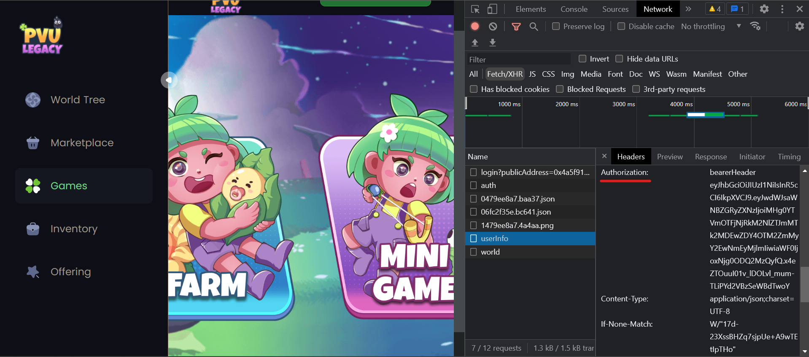

# PVU bot
[ [Channel](https://t.me/Cum_Insider) ] [ [Telegram](https://t.me/AlenKimov) ]

- [Установка под Windows](#Установка-под-Windows)
- [Установка под Ubuntu](#Установка-под-Ubuntu)
- [Работа со скриптом](#Работа-со-скриптом)
- [Получение токена авторизации](#О-токене-авторизации)
- [Логика работы скрипта](#Логика-работы)


## Установка под Windows
- Установите [Python 3.11](https://www.python.org/downloads/windows/). Не забудьте поставить галочку напротив "Add Python to PATH".
- Установите пакетный менеджер [Poetry](https://python-poetry.org/docs/). Не забудьте добавить Poetry в переменную окружения Path.
- Установите [git](https://git-scm.com/download/win).
- Склонируйте этот репозиторий, после чего перейдите в него:
```bash
git clone https://github.com/AlenKimov/pvu.git
cd pvu
```
- Установите требуемые библиотеки с помощью Poetry:
```bash
poetry update
```
- [Подробнее об ошибке "Microsoft Visual C++ 14.0 or greater is required"](https://web3py.readthedocs.io/en/latest/troubleshooting.html#why-am-i-getting-visual-c-or-cython-not-installed-error)


## Установка под Ubuntu
- Обновите систему:
```bash
sudo apt update && sudo apt upgrade -y
```
- Установите [git](https://git-scm.com/download/linux) и screen:
```bash
sudo apt install screen git -y
```
- Установите Python 3.11 и зависимости для библиотеки web3:
```bash
sudo add-apt-repository ppa:deadsnakes/ppa
sudo apt install python3.11 python3.11-dev build-essential libssl-dev libffi-dev -y
ln -s /usr/bin/python3.11/usr/bin/python
```
- Установите [Poetry](https://python-poetry.org/docs/):
```bash
curl -sSL https://install.python-poetry.org | python -
export PATH="/root/.local/bin:$PATH"
```
- Склонируйте этот репозиторий, после чего перейдите в него:
```bash
git clone https://github.com/AlenKimov/pvu.git
cd pvu
```
- Установите библиотеки следующей командой (или запустите `install-libraries.bat` на Windows):
```bash
poetry update
```

## Работа со скриптом
Для запуска скрипта пропишите следующую команду (или запустите `start.bat` на Windows):
```bash
poetry run python start.py
```

После первого запуска создадутся файлы `private_keys.txt` и `tokens.txt` в папке `input`.

Для доступа к аккаунту PVU боту требуется токен авторизации.

Токен авторизации можно либо [достать самому](#О-токене-авторизации) и внести в файл `tokens.txt`, 
либо его автоматически будет создавать бот. Для последнего нужно внести приватный ключ (не сид-фраза)
в файл `private_keys.txt`.

Некоторые параметры бота можно изменить в файле `bot/config.py`.


## О токене авторизации
Получить токен авторизации можно следующим способом:
1. Авторизуемся с нашим кошельком на сайте PVU.
2. Заходим в инструменты разработчика, вкладка **Сеть** (**Network**) [**Ctrl + Shift + I**].
4. Выбираем фильтр **Fetch/XHR**.
5. Обновляем страницу [**Ctrl + R**].
6. Находим запрос `userinfo` (можно другой) и в **заголовках запроса** (**Headers**) копируем значение поля `Authorization`:



## Логика работы
...
